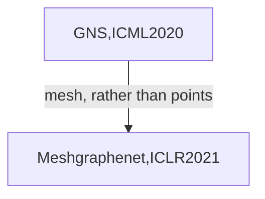

# Researchers-in-AI4S

This is the summary for researchers in AI for Science. Currently, the updating list only contained people in the field of AI + applied mathematics and mechanics sorted by Shizheng Wen. Other fields like AI + Molecular dynamics, materials/chemistry/biology will be sorted out soon.

(:notebook: Please ignore the note, which is some characteristics for me to remember.) 

# :man_scientist:Mainstream ML

Most of the following researchers have a strong background in applied mathematics (numerical analysis and dynamical systems) and data science (machine learning, optimization and statistics), and come from the department of computer science and mathematics in different universities or research institutes (DeepMind, MSR, Google and etc.). They are in the mainstream machine learning community and perfer to publish paper in machine learning conference.

| Name | Institution | Research Field | Note |
|:------:|:----------:|:----------------:|:-----:|
|[Michael Bronstein](https://twitter.com/mmbronstein)| Prof @ Oxford/Deepmind/twitter|Geometric DL, GNN| [Online Course 2022](https://www.youtube.com/watch?v=5c_-KX1sRDQ)|
| [Anima Anandkumar](http://tensorlab.cms.caltech.edu/users/anima/index.html)|Prof @Caltech/Nvidia|AI+Science (FNO)|Received her PhD degree at 2009|
| [Max Welling](https://staff.fnwi.uva.nl/m.welling/) |Prof @UoA/MSR|AI+Science(PDE, MD);GNN;Bayes|Received his PhD in Physics|
|[Siddhartha Mishra](https://camlab.ethz.ch/news-and-events.html)| Prof @ETH |Numerical Analysis; AI for physics; physics for AI|Approximation Theory and error bound of PINN, DeepOnet, FNO; DS for GNN|
|[Michael Mahoney](https://www.stat.berkeley.edu/~mmahoney/)| Prof. @UCBerkely |Statics, SciML|Experienced in Graph, HPC, SciML ...|
|[Stephan Günnemann](https://www.cs.cit.tum.de/daml/guennemann/)| Prof. @TUM |GNN; ML4DS|Author of [GNN FEM network for DS](https://arxiv.org/abs/2203.08852)|
|[Benjamin Erichson](https://www.benerichson.com/)| Asist. Prof. @ U Pitts |SciML, dynamical systems, deep learning|Postdoc. of Mahoney at Berkeley and Kutz brunton at UW|
|[Jure Leskovec](https://cs.stanford.edu/people/jure/index.html)| Prof. @ Stanford |Graph Neural Network|Postdoc. of Mahoney at Berkeley. Leading researcher in the field of Graph. recording courses for GNN|
|[Tobias Pfaff](https://scholar.google.com/citations?user=3oUgDKQAAAAJ&hl=en&oi=sra)| Researcher @Deepmind |GNN for Physical Simulation| Earlier works are related to CG. Markus Gross's students. Collaborator of Nils Thuerey. First-author of meshgraphnet |
|[Alvaro Sanchez Gonzalez](https://scholar.google.co.uk/citations?user=d1oQ8NcAAAAJ&hl=en)|Researcher @Deepmind|GNN for Physical Simulation|First author of GNS. Finished many GNN related work. Have worked with Miles Cranmer ever.|
|[Peter Battaglia](https://scholar.google.com/citations?user=nQ7Ij30AAAAJ&hl=en)|Research Scientist @Deepmind|GNN, Physics Engine based on GNN|Collobrate with Pfaff and Gonzalez for many GNN works.|
|[Stephan Hoyer](http://stephanhoyer.com/)| Researcher @GoogleAI |DL for Physicals Science| Active in Twitter. Many representative works include Lagrangian NN, ML accelerated CFD, etc. |
| [Yarin Gal](https://www.cs.ox.ac.uk/people/yarin.gal/website/)| Prof. @Oxford| Theory:Bayesian Deep Learning; Application| Looking for students|
|[Molei Tao](https://mtao8.math.gatech.edu/)| Associate Prof. @Gatech|Dynamical ML, AI4Science, Physics4AI| Applied/Computational science. PhD student of [Houman Owhadi](http://users.cms.caltech.edu/~owhadi/index.htm) |
|[Houman Owhadi](http://users.cms.caltech.edu/~owhadi/index.htm)| Prof. @Caltech|Sci. ML, Physics informed learing and mathematics of ML| Advisor of Tao Molei, mathematician|
|[Thomas Kipf](http://tkipf.github.io/)| Researcher @Google Brain| Graph Neural Network|Student of Max Welling, first-auth. of ConvolutionalGNN (2017ICRL)|
|[Johannes Brandstetter](https://twitter.com/jo_brandstetter)|Researcher @Microsoft Research Amsterdam|Physics Geometric Deep Learning| Max Welling's Student|
|[Rose Yu](https://roseyu.com/)| Prof. @UCSD | Physics-informed ML for modeling of sptiotemporal Dynamics| from Northeastern to UCSD. Postdoc of Anime。 |
|[Aditi S. Krishnapriyan](https://a1k12.github.io/)| Assistant Prof. @UCB | physics-inspired machine learning methods; GNN; development of machine learning methods informed by physical sciences applications including molecular dynamics, fluid mechanics, climate science | Mahoney's PhD Student |
|[Andrew M. Stuart](http://stuart.caltech.edu/)| Prof @Caltech | Data Assimilation; Inverse Problem; Scientific ML | Samuel Lanthaler's (mishra's PhD) advisor for PostDoc |
|[Max Tegmark](https://space.mit.edu/home/tegmark/)| Prof. @MIT | AI for Physics; Physics for AI; Physics (Cosmology, quantum Informaiton) | Supervisor of AI Feynman and AI Poincaré (symbolic regression) |
|[Lexing Ying](http://web.stanford.edu/~lexing/)| Prof. @Stanford | PDE + Neural Network | Yiping Lu's advisor at Stanford |
|[Jianfeng Lu](https://services.math.duke.edu/~jianfeng/)| Associate Prof. @Duke | AI+PDE/Science | Phd Students of Weinan E |
|[Weinan E](https://scholar.google.com/citations?user=i2mOt14AAAAJ&hl=en)| Prof. @Princeton | AI+Science(PDE/MD) | Propose the concept of AI + Science |
|[Hod Lipson](https://www.hodlipson.com/)| Prof. @Columbia | Robotics+Hidden variables discovery | Distill natural laws from data [Science](https://www.science.org/doi/10.1126/science.1165893) [Nature CS](https://www.creativemachineslab.com/hidden-variables.html) |

# :man_scientist:Domain field ML

Follwing researchers often have a strong domain knowledge in mechanics (solid or fluid) and work on developing data-driven modeling in science and technology by utilizing algorithms from machine learning community. They are not interested in advancing new machine learning algorithm, and prefer publishing their works in top-tier journals.

|                             Name                             |          Institution           |                        Research Field                        |                             Note                             |
| :----------------------------------------------------------: | :----------------------------: | :----------------------------------------------------------: | :----------------------------------------------------------: |
| [Peter Benner](https://scholar.google.com/citations?hl=en&user=6zcRrC4AAAAJ&view_op=list_works&sortby=pubdate) |  Prof. @Max Planck Institute   |            SciML,model reduction,dynamical system            | [Researchgate](https://www.researchgate.net/profile/Peter-Benner) |
| [George Karniadakis](https://www.brown.edu/research/projects/crunch/george-karniadakis) |          Prof. @Brown          |       Math+Machine Learning; PINN; Numerical Analysis        |                        PINN, DeepOnet                        |
| [Themis Sapsis](https://sandlab.mit.edu/index.php/people/11-web-articles/46-themistoklis-sapsis) |           Prof. @MIT           | Analytical, computational and data-driven methods for modeling high-dimensional nonlinear systems | Know George Haller. Phd advisor of [Zhongyi Wan](https://www.linkedin.com/in/zhong1wan/) |
| [petros koumoutsakos](https://cse-lab.seas.harvard.edu/?_gl=1*1jmnooa*_ga*MTE5MzU4NjQwOS4xNjc0MjA5OTUw*_ga_FNNHYP076Y*MTY3NDIwOTk1MC4xLjAuMTY3NDIwOTk1MC4wLjAuMA..*_ga_Q97GE6JKJ9*MTY3NDIwOTk1MC4xLjAuMTY3NDIwOTk1MC4wLjAuMA..) |         Prof. @Harvard         | Physical Simulation (fluid, molecular), Machine Learning, HPC |                      Golden Bell Prize                       |
|        [Steven Brunton](https://www.eigensteve.com/)         |           Prof. @UW            |      Data-driven dynamics and control, fluid mechanics       | first-author of ARFM (fluid and ML); sparse identification; POD/DMD; |
|     [Nathan Kutz](https://faculty.washington.edu/kutz/)      |           Prof. @UW            |          Applied Mathematics; Data-driven dynamics           |                 Closely worked with Brunton                  |
|         [Bernd R Noack](http://www.berndnoack.com/)          |   Prof. @HIT(sz) @TU Berlin    |                       Fluid Mechanics                        |        Closely collobrated with Brunton, Weiwei Zhang        |
|          [George Haller](http://georgehaller.com/)           |          Prof. @ETHz           |             Dynamical System + Machine Learning              |                      Manifold-based ROM                      |
|     [Rajeev Jaiman](https://mech.ubc.ca/rajeev-jaiman/)      |      Associate Prof. @UBC      |        Fluid-structure interaction + Machine Learning        |                   Once at NUS, know Dowell                   |
|        [Ricardo Vinuesa](https://www.vinuesalab.com/)        |      Assistant Prof. @KTH      |                     Fluid Mechanics + ML                     |                   collobrated with Brunton                   |
|          [Dennis M. Kochmann](https://mm.ethz.ch/)           |           Prof. @ETH           |               Solid Mechanics, Materials + ML                |                       Once at Caltech                        |
|     [Karthik Duraisamy](https://caslab.engin.umich.edu/)     |          Prof. @Umich          |                       Turbulence + ML                        | First-author of ARFM ('Turbulence modeling in the age of data') |
|        [WaiChing Sun](https://www.poromechanics.org/)        |        Prof. @Columbia         |        Solid Mechanics; computational mechanics + ML         | Author of Manifold embedding data-driven mechanics; especially like publishing paper in CMAME |
| [Heng Xiao](https://scholar.google.com/citations?user=OhOwpxwAAAAJ&hl=en) | Prof. @University of Stuttgart |               Fluid Mechanics (Aerospace) + ML               |         once at VT, co-author of ARFM with Duraisamy         |
| [Eleni Chatzi](https://www.linkedin.com/in/ACoAAAI7IeABSMsWxcm7jCCOa4j1Z_p5laVXan0) |           Prof. @ETH           |            Structural Mechanics & Monitoring + ML            |                   Got her PhD in Columbia                    |
|        [Laura De Lorenzis](https://compmech.ethz.ch/)        |           Prof. @ETH           |              Solid/Computational Mechanics + ML              |                     New Editor in CMAME                      |
|            [Sid Kumar](https://www.mech-mat.com/)            |     Assistant Prof. @Delft     |                 Mechanics and Materials + ML                 |                     Student of Lorenzis                      |
|      [Jianxun Wang](http://sites.nd.edu/jianxun-wang/)       |    Assistant Professor @UND    |                     Fluid Mechanics + ML                     |                    Students of Hang Xiao                     |
|           [Jinlong Wu](https://www.jinlongwu.org/)           |    Assistant Professor @UWM    |               Data-driven dynamics (mechanics)               | Students of Hang Xiao, Postdoc of [Andrew M. Stuart](http://stuart.caltech.edu/) |
|       [Lailai Zhu](https://lailaiflow.com/index.html)        |      Assistant Prof. @NUS      | low-Reynolds-number fluid-structure interactions (bio, microfluidics) NUS |                   Postdoc of Howard stone                    |
| [Gianluca Iaccarino](https://profiles.stanford.edu/gianluca-iaccarino) |        Prof. @Stanford         |               Aerospace + Datadriven Modeling                |               co-author of ARFM with Duraisamy               |
| [Leonardo Andrés Zepeda Núñez](https://people.math.wisc.edu/~lzepeda/) |                                |                                                              |                                                              |

# :man_scientist:Chinese Researchers

Following researchers are working at Universities in China now. One of their research fields is scientific machine learning.

|                             Name                             | Institution  |          Research Field          |
| :----------------------------------------------------------: | :----------: | :------------------------------: |
| [孙浩](https://gsai.ruc.edu.cn/addons/teacher/index/info.html?ruccode=DT9TagY1BDFRNgY2B2YHMg%3D%3D&ln=cn) | 中国人民大学 |      科学机器学习，符号回归      |
|     [董彬](https://www.ai.pku.edu.cn/info/1135/1205.htm)     |   北京大学   |        数值，机器学习理论        |
| [张伟伟](https://baike.baidu.com/item/%E5%BC%A0%E4%BC%9F%E4%BC%9F/16700809?fr=aladdin) | 西北工业大学 | 流固相互作用，数据驱动的机器学习 |
|    [王立威](http://www.ai.pku.edu.cn/info/1284/1642.htm)     |   北京大学   |           机器学习理论           |
|     [毛志平](https://math.xmu.edu.cn/info/1084/9981.htm)     |   厦门大学   |         物理信息神经网络         |

# :man_student:Young Researchers

Following people are PhD candidates or just have finished their PhD degrees recently. Some of them are very young but have already conducted representative works.

|                             Name                             |       Institution        |                    Mainly Research Field                     |                       Representatives                        |
| :----------------------------------------------------------: | :----------------------: | :----------------------------------------------------------: | :----------------------------------------------------------: |
|        [Ziming Liu](https://kindxiaoming.github.io/)         |           MIT            |                    AI4Physics; Physics4AI                    |                         AI Poincaré                          |
| [Yiping Lu](https://sites.google.com/view/yipinglu2prime/home?pli=1) |         Stanford         |            Differential equations Neural Network             |                 PDE-Net; Bridging NN and DF                  |
|          [Zongyi Li](https://zongyi-li.github.io/)           |         Caltech          |                        Scientific ML                         |                             FNO                              |
| [Silviu-Marian Udrescu](https://scholar.google.com/citations?user=maphp-0AAAAJ&hl=en) |           MIT            |         Particle Physics and Artificial Intelligence         |                          AI Feynman                          |
|       [Konstantin Rusch](https://konstantinrusch.com/)       |           ETH            |                  Physcis (DS) for ML (GNN)                   |              Graph-Coupled Oscillator Networks               |
|         [Miles Cranmer](https://astroautomata.com/)          |        Princeton         |            Symbolic regression; AI; Astrophysics;            | Rediscovering orbital mechanics with machine learning; Lagrangian NN |
|      [Samuel Lanthaler](https://slanthaler.github.io/)       |         Caltech          |     Numerical Analysis (NA) and NA for operator learning     |                 Error estimates for DeepOnet                 |
|      [Nikola B. Kovachki](https://kovachki.github.io/)       |         Caltech          | machine learning methods for the physical sciences in theory and practice |         Approximation theory and error bound for FNO         |
|           [Shaowu Pan](http://www.shaowupan.com/)            |           RPI            |                  Scientific ML; Turbulence                   |                     Neural Implicit Flow                     |
|          [Hannes Stärk](https://hannes-stark.com/)           |           MIT            | geometric deep learning and its application in molecular biology | Estabilish the GNN reading group [LOG2](https://m2d2.io/talks/log2/about/) |
|             [Xiaoyu Xie](https://xiaoyuxie.top/)             | Northwestern University  |   Data-driven (AI) in manufacturing, fluid/solid mechanics   | Data-driven discovery of dimensionless numbers and govern laws , Northwestern |
|           [Han Gao](https://gaohan1234.github.io/)           | University of Notre Dame |                           ML+fluid                           |     Surrogate modeling of fluid without data; PhyGeoNet      |
|            [Pu Ren](https://paulpuren.github.io/)            |           UCB            |                        Scientific ML                         |                           PhyCRNet                           |
|               [Eric Qu](https://ericqu.site/)                | Duke Kunshan University  |          Geometric Deep Learning and AI for Science          |                        Currently None                        |
|    [Jiaqing Kou](https://koujiaqing93.wixsite.com/jqkou)     |  RWTH Aachen University  |            ROM; AI in fluid-structure interaction            | Data-driven modeling for unsteady aerodynamics and aeroelasticity |
| [Zhong Yi Wan](https://scholar.google.com/citations?user=T1FxBHsAAAAJ&hl=en) |     Google Research      |                           SML; ROM                           | Data-assisted reduced-order modeling/forecasting of high-dimensional dynamical/chaotic system. |
| [Prakash Thakolkaran](https://scholar.google.ch/citations?user=xB6jRC8AAAAJ&hl=en) |          Delft           |      Deep Learning; Computational Mechanics and Design       |                          NN-EUCLID                           |
| [Mattia Cenedese](https://www.linkedin.com/in/mattiacenedese/?trk=public_profile_samename-profile&originalSubdomain=ch) |           UBS            |                 Data-driven Dynamical System                 | Data-driven modeling and prediction of non-linearizable dynamics via spectral submanifolds |
|            [Boyuan Chen](http://boyuanchen.com/)             |           Duke           |        Robotics+Hidden variables discovery+AI4Science        |             AP at duke, Hod Lipson's PhD student             |
|    [Zhengyu Huang](https://www.its.caltech.edu/~dzhuang/)    |         Caltech          | Numerical Methods+Machine Learning+Application (Fluid-structure interaction) | PhD advisor: [Charbel Farhat](https://web.stanford.edu/group/frg/) PostDoc advisor: [Andrew Stuart](http://stuart.caltech.edu/) |

**Thomas Kipf**

# Seminar, symposium, workshop, lectures, Courses
## Seminar
- [e-Seminar on Scientific Machine Learning](https://scientific-ml.org/)
- 
## Courses
- Steven Brunton's series courses:
	- [Data-Driven Dynamical Systems with Machine Learning](https://www.youtube.com/playlist?list=PLMrJAkhIeNNR6DzT17-MM1GHLkuYVjhyt)
	- [Engineering Math: Differential equations and Dynamical Syatems]()
	- [Course Website](https://www.youtube.com/c/Eigensteve/playlists) 